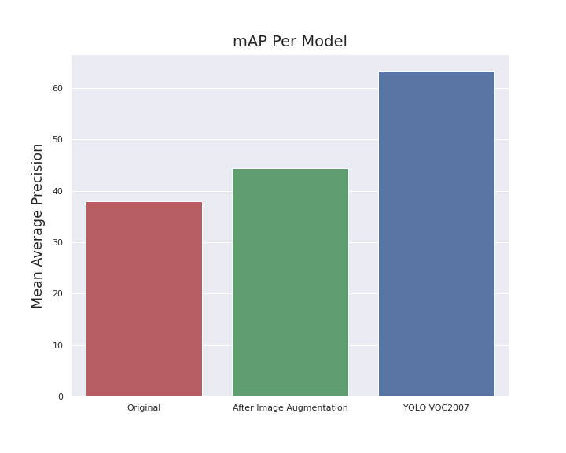

# Finding Toilet Paper
At the time of the project, I've been wanting to find a way to get more familiar with convolutional neural networks. At the same time, a new strain of coronavirus had reached pandemic levels of prevalency. This has caused people to panic buy face masks, hand sanitizer, and toilet paper. As a result, I decided to try to create a model that would be able to detect a roll of toilet paper in an image.
The data are images of rolls of toilet paper from Google Images.
 

- [EDA](#EDA)
- [The Model](#Model)
- [Evaluation](#Evaluation)
 

## Exploratory Data Analysis 
Unlike "ordinary" tabulated data, images don't have any obvious features about them to explore. Instead, I found other interesting ways to explore the data, most of which seem to focus on the images' metadata.

### Image Histogram
One interesting graph is an image's histogram of the grayscale values for each pixel, such as the one below:

  

This is the image histogram of a random image I used in the training set. Since there are a couple of peaks at fair distances apart, we can say that there is some contrast in the image. This seems to provide a more quantifiable way to measure the contrast of an image, although it still is somewhat of an eye test.

### RGB and YCrCb Color Spaces
We can also look at each RGB channel individually to see how much information is in each for a random picture in the dataset:

  

Here we see that there isn't much difference among channels, other than the red radiator in the back standing out more in the red channel than in the others. This tells us that maybe using only one channel, or maybe just the grayscale version of the picture, may give us most of the information while reducing the number of computations.

By reading the image in the luminance-chrominance color space, and then viewing each of the channels individually again, we get the following:

  

The luminance component seems to maintain what we see in the original image the most, while the chrominance channels don't seem to provide much information, and actually, grayscale is exactly this. Grayscale is just the luminance channel, which contains information on the "brightness," while having no color. This is nice to know if I ever want to train the model more quickly, for a fast test.

## The Model 
The model uses YOLOv3's architecture. Therefore, it is a 106 layer fully convolutional neural network that outputs values for the bounding boxes for each roll of toilet paper that it detects, and the probability that the object is toilet paper, in each image. It can then use this information to plot the bounding boxes on the image so we can visually see where the rolls of toilet paper are.

## Evaluation 
The evaluation metric I used is the mean average precision (mAP), a metric based on precision and recall. The graph shows the model's mAP before and after applying image augmentation in an attempt to improve performance:

  

I also included YOLO's initial architecture's mAP in a competition it was used in 2007 as sort of an underestimate for how much it can improve up to.

Another way to see how well the model performs is by looking at the images after having the bounding boxes plotted onto them. Below shows images that were passed through the model before and after implementing image augmentation:

  Before:
   
   
   
   
   
   
  After:
   
   
   

We see that the model starts to pick up the more obvious rolls of toilet paper such as the ones in the front, but fail to detect the more ambiguous rolls that are covered in the back. The bounding boxes also become a little bit more defined and in general, the probabilities that the detected objects are toilet paper are higher after image augmentation.
 
 
One drawback of the model is that it seems to have started overfitting. After looking at images passed through the model before and after image augmentation, I noticed that some images that had toilet paper detected, started to lose those detections, meaning more false negatives. This can be due to the neural network refining its weights based on a small dataset and therefore having only a limited number of images to learn from, which may not be completely representative of what toilet paper looks like.
